# Production-Grade VPC Architecture on AWS

> A hands-on cloud networking project built from scratch to understand how real-world applications are hosted securely on AWS.

---

## What This Project Is

I built this to understand how companies actually run their applications on AWS. Not just clicking buttons, but understanding **why** things are placed where they are — why some servers sit in private subnets while others face the internet, why we need multiple availability zones, and how traffic flows safely without exposing everything to the public.

This is a **two-tier architecture** spread across **two availability zones** for high availability. It includes public subnets for load balancing, private subnets for application servers, NAT gateways for secure outbound access, and an Auto Scaling Group to handle traffic spikes automatically.

---

## Architecture Overview

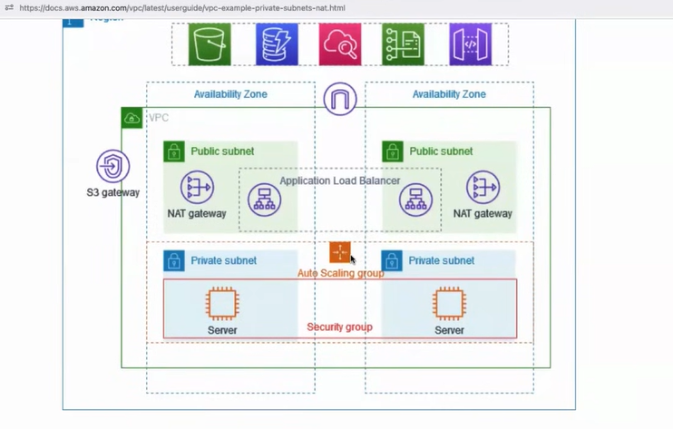

---

## What I Built (Component by Component)

### 1. VPC & Networking Foundation
- Created a custom VPC with a `/16` CIDR block to have enough IP addresses for future growth
- Split the network into **public subnets** (for load balancers) and **private subnets** (for application servers)
- Spread everything across **two availability zones** so if one AZ goes down, the application stays up
- Set up **route tables** to control traffic flow — public subnets route to the Internet Gateway, private subnets route to NAT Gateways

### 2. Internet Gateway & NAT Gateways
- **Internet Gateway (IGW)**: Attached to the VPC so public-facing resources can talk to the internet
- **NAT Gateways (2x)**: Placed one in each public subnet so private EC2 instances can download updates or call external APIs **without being directly exposed to the internet**
- This was the key learning — private servers need outbound internet too, but we don't give them public IPs. NAT handles that securely.

### 3. Application Load Balancer (ALB)
- Deployed an ALB across both public subnets to distribute incoming traffic
- The ALB is the **single entry point** — users hit the ALB, and it forwards traffic to healthy EC2 instances in private subnets
- This means the actual application servers are **never directly reachable** from the internet

### 4. Auto Scaling Group (ASG)
- Created a launch template with a custom AMI setup
- Configured the ASG to maintain a minimum number of healthy instances across both AZs
- If traffic spikes, ASG can spin up more instances. If instances fail, ASG replaces them automatically
- This is where I understood what "high availability" actually means in practice — not just having backups, but having **automated recovery**

### 5. Security Groups (Layered Defense)
- **ALB Security Group**: Allows only HTTP/HTTPS (ports 80/443) from the internet (`0.0.0.0/0`)
- **EC2 Security Group**: Allows traffic **only from the ALB** (not from the internet directly). This is the "defense in depth" principle — even if someone finds an EC2 IP, they can't reach it directly
- **Bastion/Jump Host SG** (optional): Allowed SSH (port 22) only from my IP address for troubleshooting

---

## Key Design Decisions

| Decision | Why I Made It |
|----------|--------------|
| **Two AZs instead of one** | If us-east-1a fails, us-east-1b keeps serving traffic. Real production systems don't rely on a single data center. |
| **Private subnets for EC2** | The servers running the actual application should never be directly exposed. Only the load balancer faces the internet. |
| **NAT Gateways instead of public IPs on EC2** | Private instances still need to download patches, fetch packages, or call external APIs. NAT gives them outbound internet without inbound exposure. |
| **ALB in public, EC2 in private** | This is the classic "DMZ" pattern. The ALB acts as a gatekeeper. |
| **Auto Scaling** | Manual server management doesn't scale. ASG handles failures and traffic spikes without me waking up at 3 AM. |

---

## How I Tested & Validated (From My RHEL 10 VM)

I didn't just build this in the AWS console and call it done. I validated every layer from my **Red Hat Enterprise Linux 10 virtual machine** running on VMware Workstation — the same environment I use for my RHCSA studies.

**Why this matters:** SSH key management, file permissions (`chmod 400`), and troubleshooting connection issues from a Linux terminal are core sysadmin skills. Doing this from RHEL instead of Windows/Putty kept me in the Linux mindset I'm training for.

| What I Did | Command/Tool | What I Learned |
|-----------|--------------|----------------|
| **Transferred the .pem key** | `scp` from shared folder (`/mnt/hgfs/`) to `/root/.ssh/` | VMware shared folders don't preserve Linux permissions — had to `cp` to native filesystem first, then `chmod 400` |
| **SSH into public bastion** | `ssh -i /root/.ssh/key.pem ec2-user@<public-ip>` | Verified key-based auth works and security group allows port 22 |
| **SSH into private instances** | `ssh -i /root/.ssh/key.pem ec2-user@<private-ip>` (via bastion) | Confirmed private subnet instances are reachable only through the jump host |
| **Validated web server** | `curl http://<alb-dns-name>` from RHEL VM | Confirmed ALB is distributing traffic to healthy targets |
| **Tested outbound internet from private EC2** | `ping 8.8.8.8` and `yum update` from private instance | Verified NAT Gateway is routing outbound traffic correctly |
| **Checked logs** | `journalctl`, `/var/log/messages` | Standard Linux troubleshooting on cloud instances |

**The connection between RHCSA and AWS:** Understanding Linux networking (IP routing, DNS resolution, firewall rules with `firewalld`) made the AWS VPC concepts click faster. When a private instance couldn't reach the internet, my first instinct was to check routes — not random buttons in the console.

---

## Screenshots & Proof

Below are the actual screenshots from my AWS console showing the live infrastructure:

### 1. VPC & Subnet
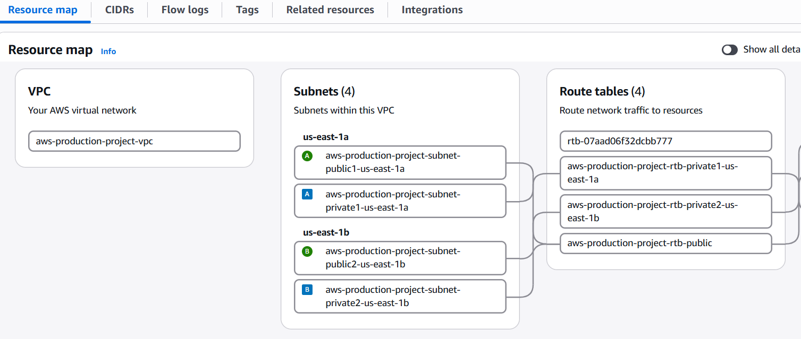
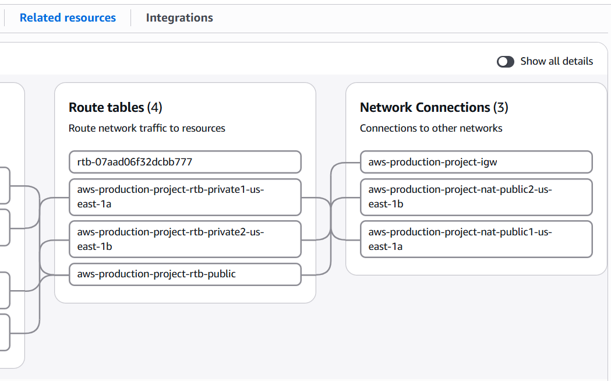

> Created a VPC with public and private subnets across two AZs. The CIDR blocks were planned so there's room for expansion without re-architecting.

### 2. Internet Gateway
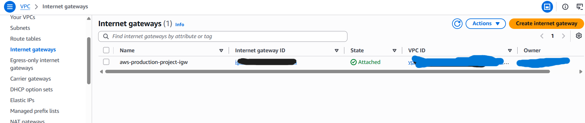

> Public subnets route `0.0.0.0/0` to the Internet Gateway. Private subnets route outbound traffic to the NAT Gateway instead.

### 3. NAT Gateways in Public Subnets
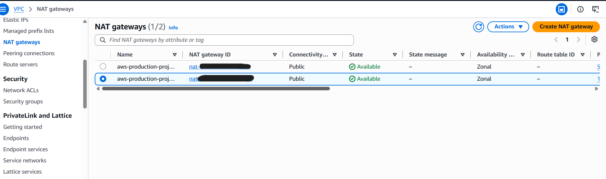

> One NAT Gateway per AZ for redundancy. This allows private EC2 instances to reach the internet for updates without exposing them publicly.

### 4. Application Load Balancer Setup
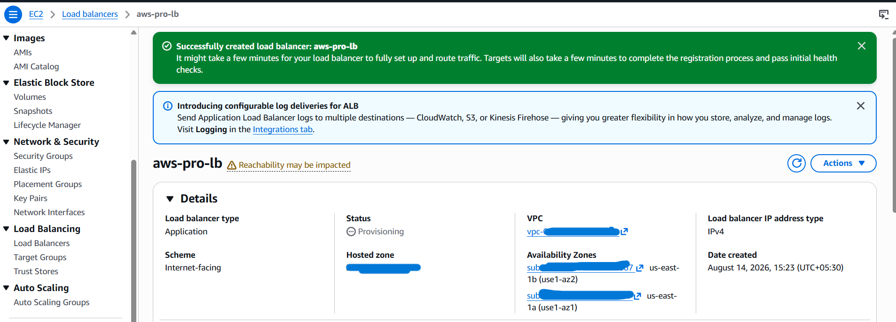

> ALB spans both AZs and listens on HTTP. It forwards traffic to the target group containing private EC2 instances.

### 5. Target Group & Health Checks
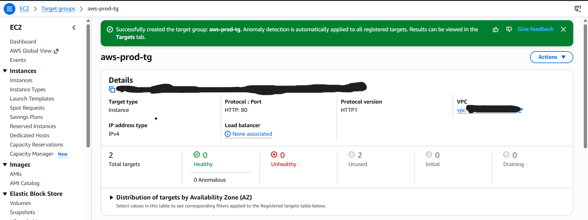

> EC2 instances are registered as targets. The ALB continuously health-checks them and only sends traffic to healthy ones.

### 6. Auto Scaling Group
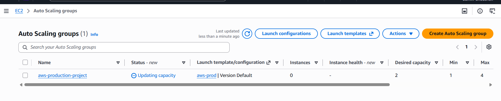

> Configured with a launch template. ASG maintains the desired number of instances and replaces any that fail health checks.

### 7. Launch Template
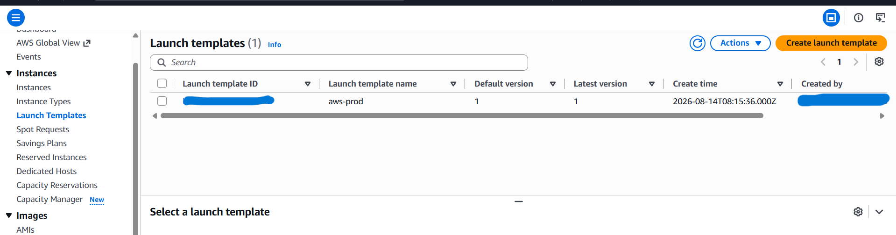

> The template defines what each new instance looks like — AMI, instance type (t3.micro), key pair, and security group attachments.

### 8. Creating Bastion-Host
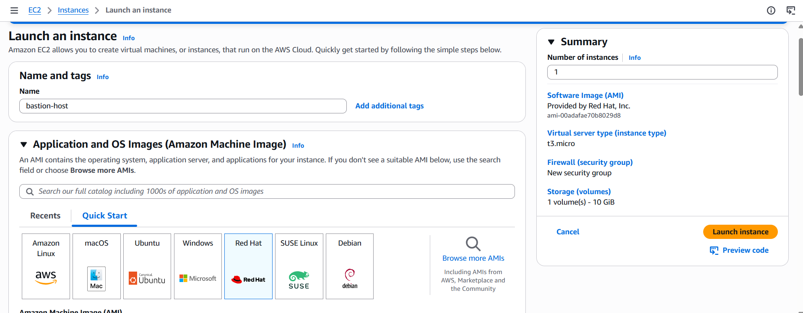

> ALB allows ports 80/443 from anywhere. EC2 only allows traffic from the ALB's security group. SSH is restricted to my IP only.

### 9. EC2 Instances Running in Private Subnets
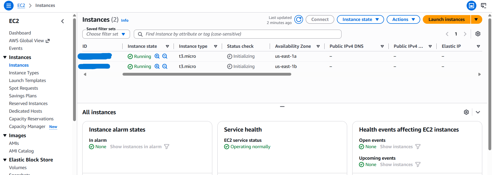

> These instances have no public IPv4 address. All inbound traffic comes through the ALB. Outbound goes via NAT.

### 10. SSH Validation from RHEL 10 VM
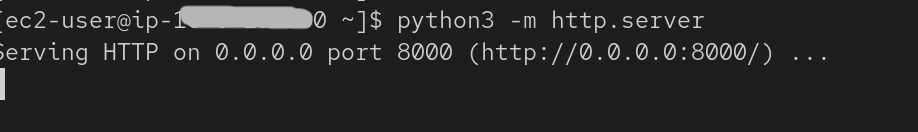

> Successfully SSH'd into both public bastion and private instances from my RHEL 10 VM. This validated the entire network path from my local Linux environment to the cloud.

### 11. HTML Page Successfully displayed
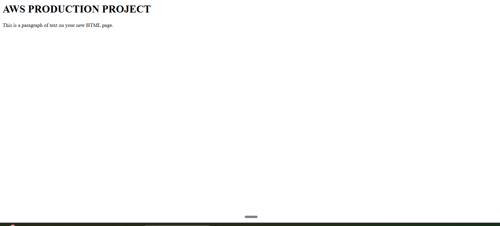

> This is the AWS reference architecture I used as a blueprint. My implementation follows this pattern exactly.

---

## Tools & Services Used

| Category | Service |
|----------|---------|
| Networking | VPC, Subnets, Route Tables, Internet Gateway, NAT Gateway |
| Compute | EC2 (t3.micro), Auto Scaling Group, Launch Templates |
| Load Balancing | Application Load Balancer (ALB), Target Groups |
| Security | Security Groups, Network ACLs (default) |
| Local Environment | RHEL 10 VM on VMware Workstation |

---

## Cost Awareness

I built this on the **AWS Free Plan** with $140 in credits. Here's what I learned about costs:

| Component | Cost Impact | Lesson |
|-----------|-------------|--------|
| EC2 t3.micro | Free Tier eligible (750 hrs/month) | Always check the "Free Tier eligible" badge |
| NAT Gateway | ~$32/month each | Biggest learning — some infrastructure has baseline costs even when idle |
| ALB | ~$16/month + LCU charges | Load balancers aren't free, but they're essential for production patterns |
| Data Transfer | First 100GB out is free | Monitor this if you have heavy outbound traffic |

**Total project cost:** Used a small portion of Free Tier credits. The real value was understanding what costs money and why.

---

## How to Recreate This

If you want to build this yourself, here's the high-level flow:

1. **VPC & Subnets**: Create VPC → 2 public subnets → 2 private subnets → spread across 2 AZs
2. **Internet Gateway**: Create IGW → Attach to VPC → Add route `0.0.0.0/0` to IGW in public route table
3. **NAT Gateways**: Create 2 NAT GWs (one per public subnet) → Add route `0.0.0.0/0` to NAT GW in private route table
4. **Security Groups**: ALB SG (80/443 open) → EC2 SG (only from ALB SG) → Bastion SG (port 22, your IP only)
5. **EC2 Launch Template**: Choose AMI → t3.micro → Attach EC2 SG → Add user data if needed
6. **ALB**: Create ALB in public subnets → Create target group → Register EC2 instances (or let ASG do it)
7. **Auto Scaling Group**: Use the launch template → Attach to target group → Set min/max/desired capacity
8. **Test from Linux**: SSH from your local Linux VM to validate connectivity, test `curl` against ALB, verify NAT outbound access

---

## What I'd Do Differently Next Time

- **Use Terraform or CloudFormation** instead of clicking through the console. Infrastructure as Code is how real teams work, and it prevents the "wait, how did I configure that?" problem.
- **Add CloudWatch alarms** for CPU and memory so I know when ASG is actually scaling.
- **Set up a CI/CD pipeline** to deploy application updates automatically instead of manually updating instances.
- **Use AWS Systems Manager Session Manager** instead of a bastion host + SSH keys — more secure and no open port 22.
- **Document the RHEL-to-AWS workflow better** — the `scp` from VMware shared folder, `chmod 400`, and SSH hop through bastion is a repeatable pattern worth templating.

---

## About Me

I'm learning cloud infrastructure with a focus on **Linux systems and site reliability**. This project was part of my journey toward understanding how production networks are designed. I believe the best way to learn is to build, break, and fix things.

Currently studying: **Linux (RHCSA track), AWS core services, DevOps Concepts and Python automation.**

Looking for **SRE / DevOps / Cloud internships** where I can apply these fundamentals and grow with a team.

---

## Connect With Me

- LinkedIn: https://www.linkedin.com/in/anousheh-hussain/
- Email: anousheh.hussain@gmail.com
- Hashnode: https://cloudgirllogs.hashnode.dev/

---

*This project was built entirely by me as a learning exercise. All screenshots are from my own AWS account. Architecture inspired by AWS best practices for multi-AZ web applications.*
